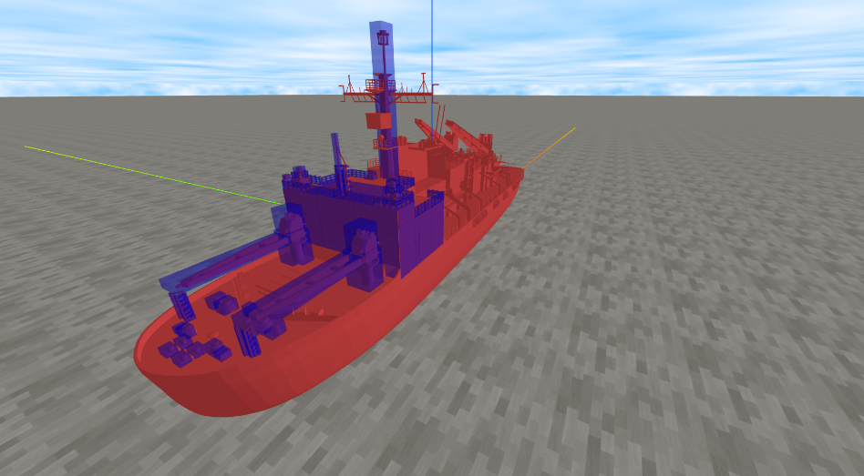
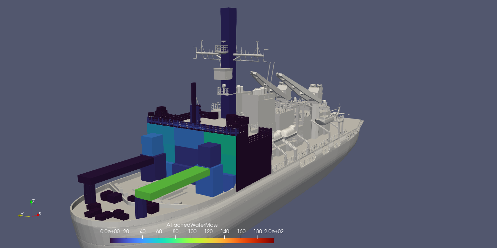

# RectPlacer

[](https://github.com/akonno/RectPlacer/actions/workflows/ci.yml)
[](https://doi.org/10.5281/zenodo.21515192)

RectPlacer is a browser-based tool for defining and managing axis-aligned
cuboid regions on STL models, primarily intended for numerical analysis
preprocessing and research workflows.

## Live demo and documentation

RectPlacer runs entirely in the browser; no installation is required for
normal use.

- **Live Demo**: https://akonno.github.io/RectPlacer/
- **Documentation**: https://akonno.github.io/RectPlacer/docs/

## Intended use cases

- Numerical analysis preprocessing (CFD, DEM, particle tracking)
- Definition of regions of interest (ROI) on complex STL geometries
- Research and engineering workflows where CAD tools are excessive
- Parametric, text-based management of spatial regions

## Screenshot



*Example of defining multiple axis-aligned cuboid regions on an STL model.*

## Core functionality

- **Load an STL file**: Load a 3D object from an STL file into the scene.
  When a model is loaded, the camera automatically adjusts its distance to
  frame it.
- **Place multiple cuboids**: Create and position multiple
  axis-aligned cuboids in the same space as the STL model.
- **Edit cuboid data as text**: Dimensions and positions of every cuboid
  are edited directly in a text area; the 3D view updates as you type.
- **Save cuboid data**: Export the current cuboid definitions to a CSV
  file for later reuse.

## Quick start using the live application

1. Open the [Live Demo](https://akonno.github.io/RectPlacer/).
2. Obtain the sample dataset from this repository:
   [`samples/sample-structure.stl`](samples/sample-structure.stl) and
   [`samples/sample-structure-rects.csv`](samples/sample-structure-rects.csv)
   (for example, by cloning the repository or downloading the two files
   individually from GitHub). This is a small synthetic structure, not
   real research data; see [Research usage](#research-usage) below.
3. In the live app, use the STL upload control to load
   `sample-structure.stl`. The camera will automatically frame the model.
4. Open `sample-structure-rects.csv` in a text editor and paste its
   contents into the cuboid text area. Seven cuboids should appear on the
   model.
5. Edit values directly in the text area to see the cuboids update, and
   use the "Save data as CSV" button to export the result.

The sample dataset is generated by
[`scripts/generate-sample-structure.mjs`](scripts/generate-sample-structure.mjs)
from a single set of parameters, so the STL geometry and the cuboid CSV
stay consistent with each other; see
[Local development and reproducible build](#local-development-and-reproducible-build)
for how to regenerate it.

## Cuboid data format

Each non-empty line in the cuboid text area describes one cuboid as six
comma-separated numbers:

```
lx,ly,lz,x,y,z
```

- `lx`, `ly`, `lz`: edge lengths along the X, Y, and Z axes. Each must be
  a positive number.
- `x`, `y`, `z`: position of the cuboid's center, in the same coordinate
  system and units as the loaded STL model (Z is up).
- An optional leading `*` highlights the cuboid (for example, `*0.1,0.1,0.3,0.2,0,0.2`).
- Lines starting with `#` or `//` are treated as comments and ignored.
- There is no header row.

RectPlacer does not perform any unit conversion, so the cuboid
coordinates must already be expressed in the same units as the STL
model. The STL display scale set through the STL Settings dialog is a
local, view-only adjustment: it changes only how the loaded model is
rendered, does not affect the cuboid values, and is not stored when
saving. Saving writes the exact text currently shown in the text area
to a file named `rects.csv`.

## Local development and reproducible build

Normal use of RectPlacer does not require any local setup; the sections
below are useful for development, verifying reproducibility, or future
maintenance.

Requirements: Node.js 20.19+ or 22.12+ (the minimum supported by Vite 7),
and npm.

```bash
git clone https://github.com/akonno/RectPlacer.git
cd RectPlacer
npm install

npm run dev       # start a local development server
npm run build     # production build, written to dist/
npm run preview   # preview the production build locally
```

To regenerate the sample dataset described above:

```bash
npm run sample:generate
```

This overwrites `samples/sample-structure.stl` and
`samples/sample-structure-rects.csv`.

Pushes to the `main` branch that change application code build the
project and publish `dist/` to GitHub Pages automatically; pushes that
only change Markdown files (such as this README) are excluded and do not
trigger a deployment (see
[`.github/workflows/deploy-pages.yml`](.github/workflows/deploy-pages.yml)).

## Research usage

RectPlacer has been used in a conference proceeding to define and manage
structural regions on a complex STL model, for icing accumulation
analysis on ship superstructures:

- Suizu, Konno and Ozeki, "Development of a method to calculate ice
  accretion on ship superstructures," Conference Proceedings of the
  Japan Society of Naval Architects and Ocean Engineers, Vol. 39,
  2024A-OS3-7 (2024) (in Japanese).
  https://doi.org/10.14856/conf.39.0_165



*Example from the published research above: distribution of adhering
water mass on a ship superstructure under a 45° inflow angle and a wind
speed of 6 m/s, evaluated using cuboid regions defined with RectPlacer. The
underlying ship STL model and research data are not included in this
repository; the sample dataset described above is a separate, synthetic
structure provided for trying out the tool.*

## Limitations

- Only axis-aligned cuboids are supported; rotated or non-rectangular
  regions are not.
- Cuboid placement and editing is centered on the text area; there is no
  direct mouse-based manipulation of cuboids in the 3D view.
- The STL display scale is a local view setting and is not saved with
  the cuboid data.
- RectPlacer is a region-definition tool, not a CAD tool: it does not
  edit or modify the geometry of the loaded STL model.

## Citation

If you use RectPlacer in your research, please cite the software using
the metadata in [`CITATION.cff`](CITATION.cff) or GitHub's
"Cite this repository" feature.

RectPlacer v1.0.0 is archived on Zenodo:
[https://doi.org/10.5281/zenodo.21515192](https://doi.org/10.5281/zenodo.21515192).

## License

This software is released under the [MIT License](./LICENSE).
